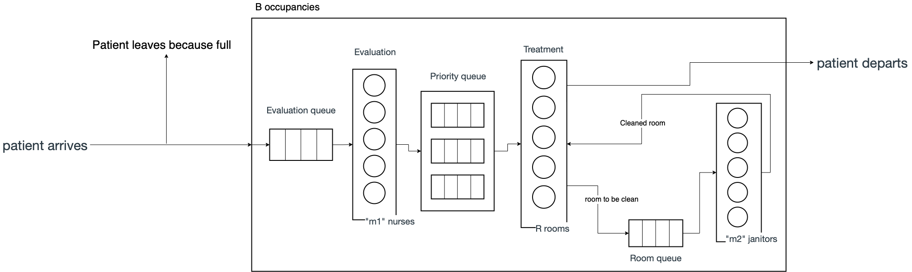

CMPT 305 Project 1

Group member  
- Bo (Jerry) Wang
- Qian (Levi) Wang
- Wenhui (Warren) Wu

Development abstract:

In 21 days, our group needs to implement a simulation mimicking a complex system. With the knowledge and skills learned from the class, we accomplished the task by using analytic (queueing) models. In addition, we get a chance to analyze the performance of this complex system by changing different input parameters. With the power of class in C++, we choose the object-oriented approach to solve the problem. With appropriate object methods, we can record the necessary information directly into the object, and report the wanted statistic result when needed.

This is the flowchart we came up for this project:

---

## Start and End of Simulation:
Simulation starts at 12 AM, and ends at 12 AM the following day.

The simulation should correctly handle any correct choice of input parameters &lambda;h ,  &lambda;m ,  &lambda;l ,  &mu;e , &mu;h , &mu;m ,
&mu;l ,
&mu;c , B, R, m1 and m2. All these parameters should be arguments to call the program, in addition to the random seed S.

## Executable:
The executable should run using the following command line parameter format:

./proj1 &lambda;h  &lambda;m  &lambda;l  &mu;e &mu;h &mu;m
&mu;l
&mu;c B R m1 m2 S

To compile and run the executable:

make proj1  
./proj1 &lambda;h  &lambda;m  &lambda;l  &mu;e &mu;h &mu;m
&mu;l
&mu;c B R m1 m2 S
